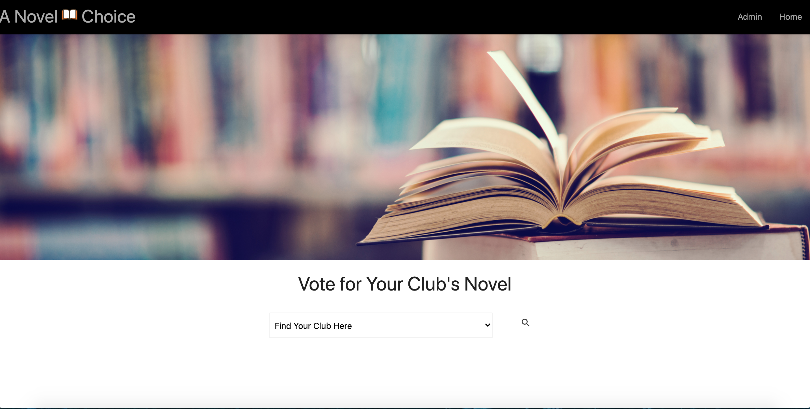
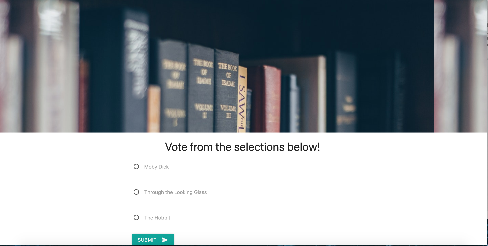
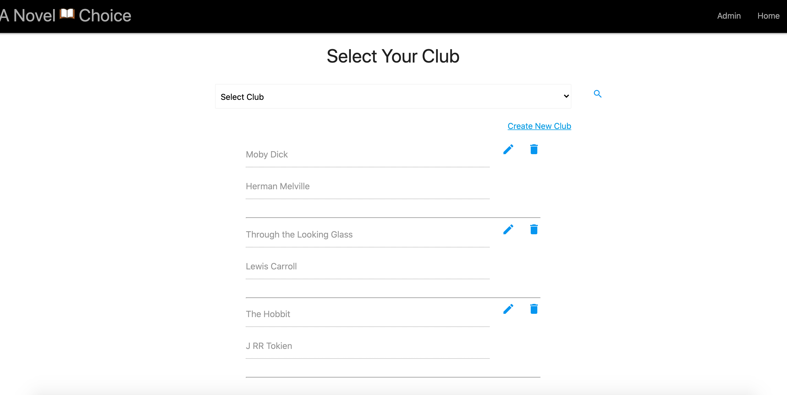

# A Novel Choice 

## Table of Contents
[Creators](#creators) 
[Packages Used](#packages-used) 
[Description](#desciption) 
[CRUD Features](#crud-features) 
[Demo](#demo) 

## Creators

**Team IRIDIUM**
 - [Estefania Lupo](https://github.com/lain7891)
 - [Elyse Wells](https://github.com/ewells89?tab=repositories)
 - [Samuel Endrias](https://github.com/settings/profile)
 - [Geoff Nix](https://github.com/FSGeoff)
 
 ## Packages Used

 

 * express 
 * express-handlebars 
 * handlebars 
 * @handlebars/allow-prototype-access 
 * mysql2 
 * sequelize 
 * sequelize-cli 

 
  
   
 
 ## Description
  Looking for your next book to read for your book club, but can’t decide on one. 
  No problem! With A Novel Choice you can decide on a category for the month and 
  have each member add in a suggested book. Once a list of books has been created 
  members can vote for the book they would like to read for the month. The book 
  with the most votes will then be the winner and your book club's next book.

  ## CRUD Features

  * GET all books
  * GET all clubs
  * POST books by club
  * PUT books by club
  * DELETE books by club
  * UPDATE books
  * EDIT books
 
 ## Demo
